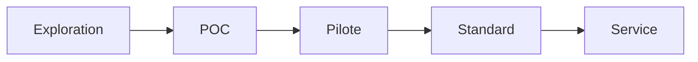

# INNOVATION STATUS

- Date : **2026-03-18**
- Responsable : **Équipe IA Platform**
- Risques principaux :
  - Dépendance au téléchargement des voix depuis Hugging Face.
  - Performance variable selon CPU/GPU disponible.
  - Qualité perçue inégale selon langue/voix.
- Prochaine étape : **Pilote métier sur flux CRM réel**.

## Statut actuel
- [ ] Exploration
- [x] POC
- [ ] Pilote
- [ ] Standard
- [ ] Prod

## Critères de passage au niveau suivant (POC -> Pilote)
1. Intégration de bout en bout sur au moins 1 application métier réelle.
2. Mesure de la latence p95 et du taux d'erreur sur 2 semaines.
3. Mise en place d'une observabilité minimale (logs structurés + alertes).
4. Validation sécurité (tokens, exposition réseau, limites de débit).

## Trajectoire

