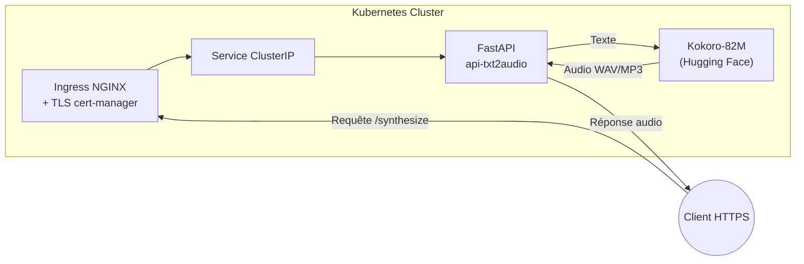

# API Text-to-Audio (Kokoro-82M)

API FastAPI de synthèse vocale multilingue (fr/en/es/it/pt/ja/zh...) basée sur le modèle `hexgrad/Kokoro-82M`.

## Démarrage rapide (≤ 10 min)

➡️ Guide OpenWebUI : `OpenWEBUI-doc/README.md`

## Construction de l'image Docker
### Option A — Exécution locale

Prérequis:
- Python 3.11+
- `ffmpeg` installé dans le PATH

```bash
make run
```

Par défaut, l'API écoute sur `http://localhost:8080` avec le token local `dev-token`.

### Option B — Exécution déterministe via Docker

```bash
docker build -t api-txt2audio:local .
docker run --rm -p 8080:8080 \
  -e API_TOKENS=dev-token \
  api-txt2audio:local
```

## Exemple reproductible entrée/sortie

```bash
curl -X POST "http://localhost:8080/v1/audio/speech" \
  -H "Authorization: Bearer dev-token" \
  -H "Content-Type: application/json" \
  -d '{"input":"Bonjour, ceci est une démonstration TTS.","voice":"heart","gender":"f","response_format":"mp3"}' \
  --output sample.mp3
```

Validation du résultat:

```bash
file sample.mp3
# attendu: Audio file with ID3 / MPEG layer III (durée > 0s)
```

## Endpoints principaux

- `GET /healthz` : statut service + cache.
- `GET /readyz` : readiness du pipeline.
- `POST /v1/audio/speech` : génération audio (`wav|mp3|opus|webm`).

## Variables d'environnement utiles

- `API_TOKENS` (obligatoire) : token(s) séparé(s) par virgule/espace (`*` pour tout accepter).
- `PORT` : port HTTP (défaut `8080`).
- `CORS_ALLOW_ORIGINS` : liste d'origines CORS.
- `RATE_WINDOW_S`, `RATE_MAX_REQ` : limite de débit.

## Documentation projet

2. Déployez l'application avec Helm :

   ```bash
   helm install api-txt2audio ./helm/api-txt2audio
   ```

3. Vérifiez que le certificat TLS est émis et que l'Ingress est configuré correctement :

   ```bash
   kubectl get ingress
   kubectl describe certificate
   ```

---

## 🧭 Diagramme d'architecture



## 🗂️ State / Flow Documentation

See `STATE.md` for the router/decision flow and a critical test-case sequence.
- Vue d'ensemble: `docs/overview.md`
- Architecture: `docs/architecture.md`
- Cas d'usage: `USE_CASE.md`
- Valeur métier: `VALUE.md`
- Statut innovation: `INNOVATION_STATUS.md`
