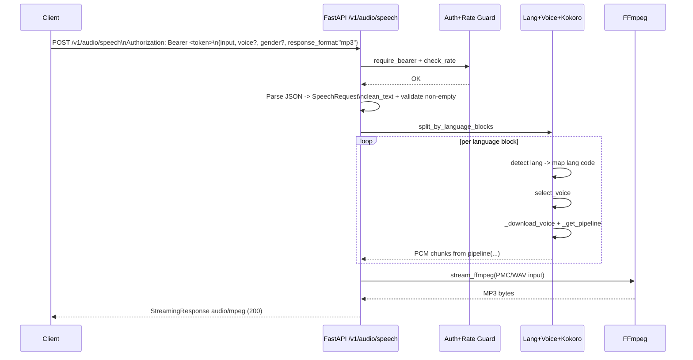

# State / Flow Project

This document captures:

- **(A) Router / Decision Flow** for request handling in `POST /v1/audio/speech`.
- **(B) A single critical test sequence** covering the happy path for MP3 generation.

## A) Router / Decision Flow

```mermaid
flowchart TD
    START([Incoming POST /v1/audio/speech]) --> AUTH{Authorization header\nBearer token valid?}
    AUTH -- No --> E401[401 auth_missing\nor 403 auth_forbidden]
    AUTH -- Yes --> RATE{Rate limit exceeded?}
    RATE -- Yes --> E429[429 rate_limit]
    RATE -- No --> PARSE{JSON payload valid\n+ SpeechRequest valid?}
    PARSE -- No --> E400JSON[400 bad_request\nInvalid JSON / schema]
    PARSE -- Yes --> TEXT{input text non-empty\nafter clean_text?}
    TEXT -- No --> E400EMPTY[400 bad_request\nEmpty input text]
    TEXT -- Yes --> BLOCKS[split_by_language_blocks]
    BLOCKS --> GEN[multilang_generator\n(lang detect -> voice select -> pipeline)]

    GEN --> FORMAT{response_format}
    FORMAT -- mp3 --> MP3[ffmpeg libmp3lame\nStreamingResponse audio/mpeg]
    FORMAT -- opus --> OPUS[ffmpeg libopus ogg\nStreamingResponse audio/ogg]
    FORMAT -- webm --> WEBM[ffmpeg libopus webm\nStreamingResponse audio/webm]
    FORMAT -- wav --> WAV[Direct WAV chunk stream\nStreamingResponse audio/wav]

    MP3 --> END([Audio stream returned])
    OPUS --> END
    WEBM --> END
    WAV --> END
```

## B) Critical Test Case Sequence (Happy Path: MP3)



## Suggested test assertion focus

1. Returns **HTTP 200** for valid token + payload.
2. `Content-Type` is `audio/mpeg` when `response_format="mp3"`.
3. Response body is non-empty streaming audio bytes.
4. No 4xx/5xx occurs in the happy path.
