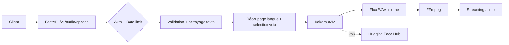

# Architecture

## Résumé technique
Le service expose une API FastAPI de Text-to-Speech :
1. authentification Bearer,
2. validation de payload,
3. découpage linguistique,
4. sélection de voix Kokoro,
5. génération audio,
6. transcodage via `ffmpeg`,
7. streaming de la réponse.

## Composants
- **Client HTTP** : envoie le texte à synthétiser.
- **FastAPI (`app.py`)** : auth, rate-limit, validation, orchestration.
- **Kokoro-82M** : pipeline de génération vocale.
- **Hugging Face Hub** : téléchargement des voix (`voices/*.pt`).
- **FFmpeg** : conversion de flux vers `wav|mp3|opus|webm`.

## Schéma

## Exécution standard
- Lancement local : `make run`
- Vérification minimale : `make smoke`
